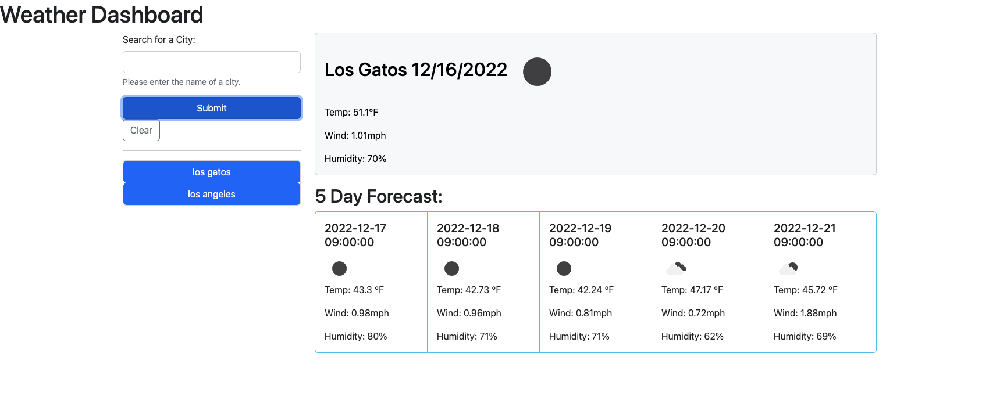

# Weather Dashboard
A weather dashboard to display the current and future 5-day weather conditions for any city.

## Description

This app allows a user to search for a city and see current and future weather conditions for any city. Past searches are saved so the user may search for a previously viewed city again.

## Usage

1. Navigate to the app on [Github Pages](https://exzilium.github.io/weather-dashboard/)
2. Enter the name of a city into the search bar in the upper left and click "Submit"
3. View the current conditions and five day forecast to decide how to pack for your trip
4. When the page is revisited later, search for the same city again from the search history on the left side list

## Credits

- [OpenWeather](https://openweathermap.org/)
- MDN web docs for [JavaScript](https://developer.mozilla.org/en-US/docs/Web/JavaScript)
- W3Schools jQuery [Tutorials](https://www.w3schools.com/jquery/)
- Day.js [Documentation](https://day.js.org/en/)

## License

N/A